

# 📚 Kelasin - Modern E-Learning Management

**Aplikasi manajemen pembelajaran terpadu untuk ekosistem digital cerdas mahasiswa dan dosen.**

[Fitur](#-fitur-unggulan) • [Arsitektur & Alur](#-arsitektur--alur-sistem) • [Database](#-skema-database) • [Screenshots](#-galeri-tangkapan-layar) • [Download](#-unduh-rilis)

---

## 📖 Tentang Kelasin

**Kelasin** adalah aplikasi Android berbasis *Jetpack Compose* yang mendigitalkan seluruh proses perkuliahan dan administrasi kampus. Mulai dari manajemen **Mata Kuliah**, **Tugas**, **Absensi**, hingga fitur terbaru yaitu **Pendaftaran Seminar**.

Ditenagai oleh **Supabase (PostgreSQL)**, aplikasi ini menyajikan data secara *real-time*, sinkronisasi antar modul secara presisi, dan estetika UI/UX tingkat premium dengan *Glassmorphism* dan *Dynamic Gradient Colors*.

---

## ✨ Fitur Unggulan

### 🎓 1. Manajemen Akademik
- **Mata Kuliah & Absensi**: Mengelola jadwal kuliah, ruangan, beserta catatan kehadiran mahasiswa yang tersinkronisasi.
- **Tugas & Materi**: Distribusi *file* materi PDF dan pelacakan *deadline* tugas secara responsif.
- **Catatan Digital & Chat**: Ruang diskusi kolaboratif.

### 🎫 2. Modul Seminar (Fitur Terbaru!)
- **Dynamic Gradient UI**: Kartu seminar dan layar riwayat mengadopsi palet warna *custom* yang ditentukan dari backend, menciptakan gradien warna cantik yang disesuaikan per kategori seminar.
- **Pendaftaran One-Tap**: Mendaftar seminar lengkap dengan validasi kuota secara *real-time*.
- **Pertanyaan Dinamis**: Form registrasi dapat dikonfigurasi admin untuk menambah pertanyaan pilihan ganda (*Dropdown*) atau isian secara *on-the-fly*.
- **Sistem Status Tiket**: Sinkronisasi status "Terdaftar", "Lolos", atau "Tidak Lolos" yang otomatis diperbarui di layar *Riwayat*.

### 🔒 3. Keamanan & Validasi
- **Real-time Error Handling**: Mengoreksi format *email*, kekuatan *password*, dan form pendaftaran seketika saat user mengetik (tanpa menunggu tombol *Submit*).
- **Konfirmasi Persetujuan**: Menggunakan *AlertDialog* dan *Checkbox Consent* untuk memastikan tidak ada kesalahan input.

---

## 📸 Galeri Tangkapan Layar

### Autentikasi & Dashboard Utama
| Login & Form Role | Home Dashboard | Dark Mode |
|:---:|:---:|:---:|
| 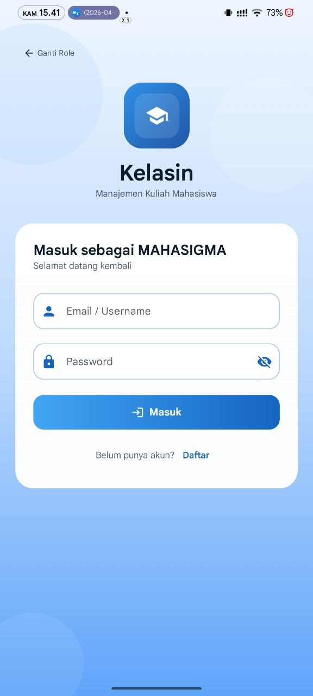 | 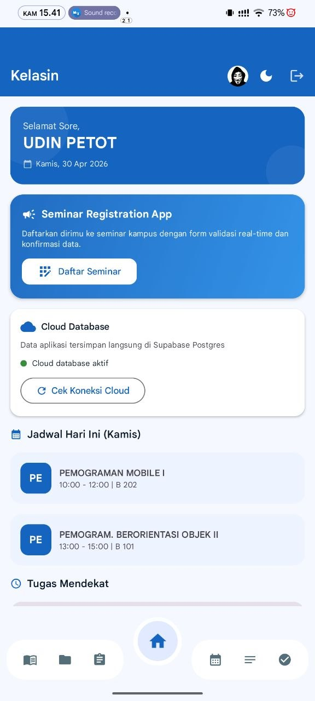 | 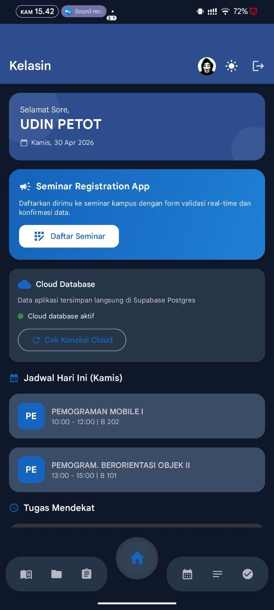 |
| 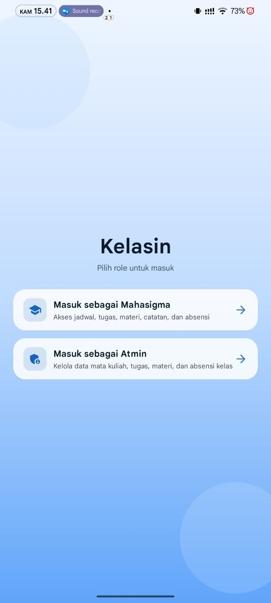 |

### Menu Akademik Lengkap
| Kalender Akademik | Mata Kuliah | Absensi & PDF |
|:---:|:---:|:---:|
| 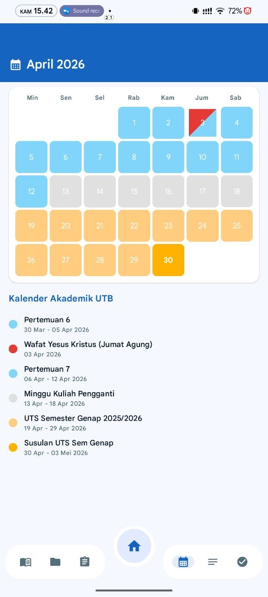 | 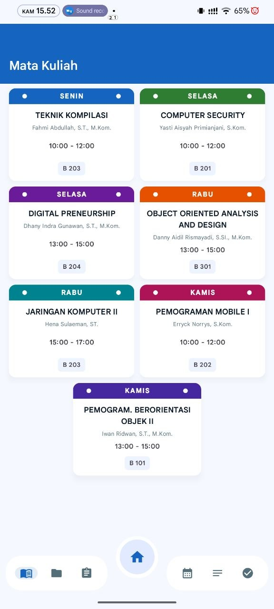 | 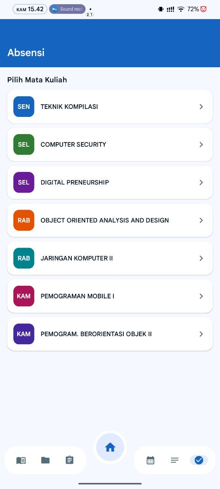 |
| 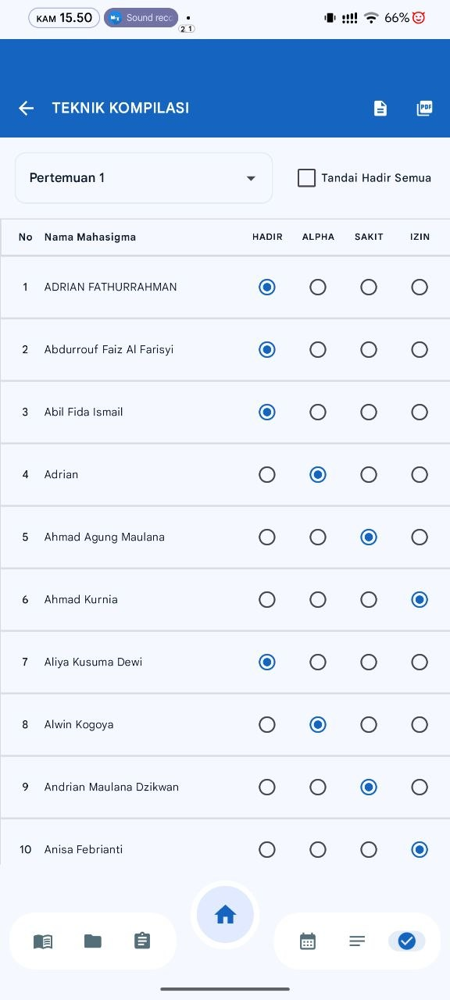 | 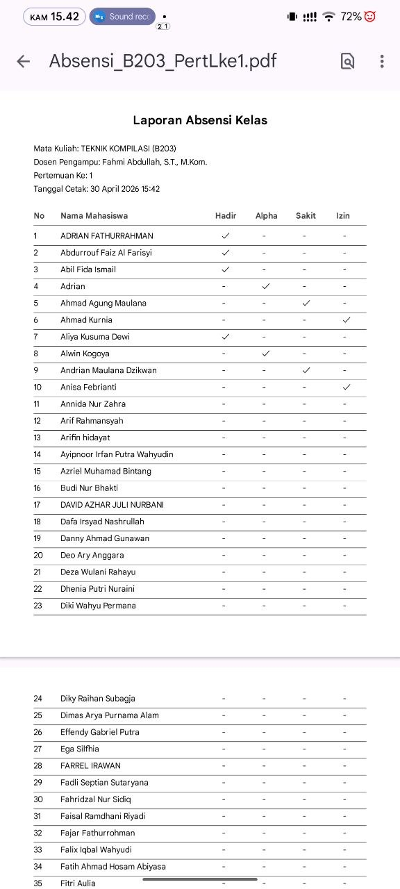 |

| Tugas & Materi | Catatan & Chat |
|:---:|:---:|
| 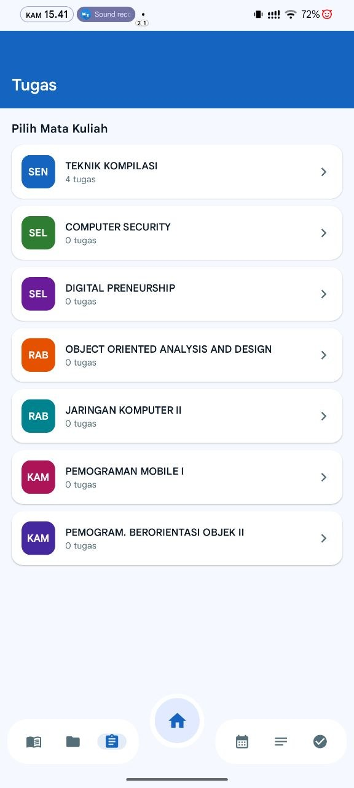 | 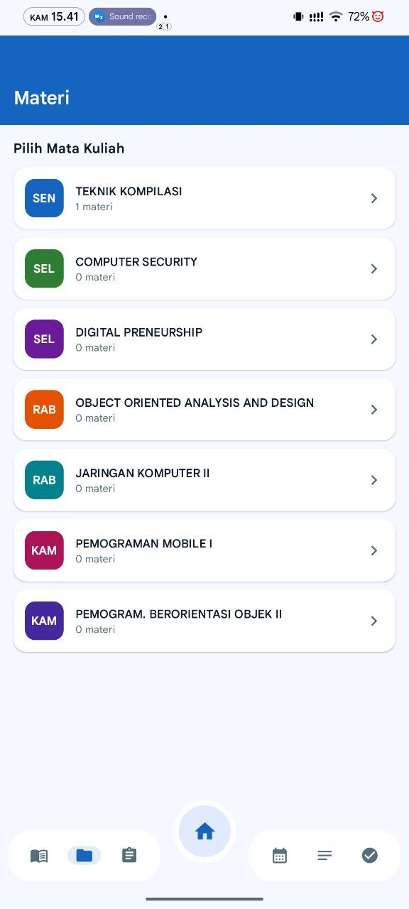 |
| 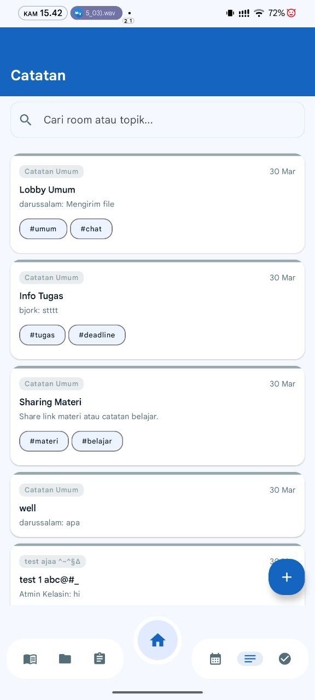 | 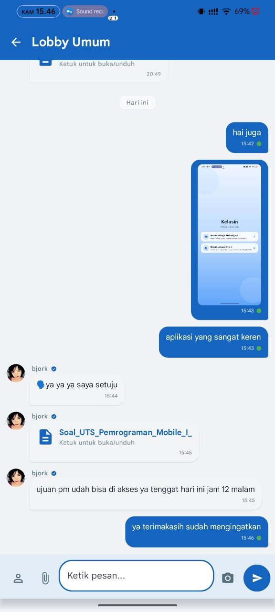 |

### 🚀 Eksklusif: Seminar Registration App
| Katalog Seminar | Form Pendaftaran Lengkap | Tiket & Detail Peserta |
|:---:|:---:|:---:|
| 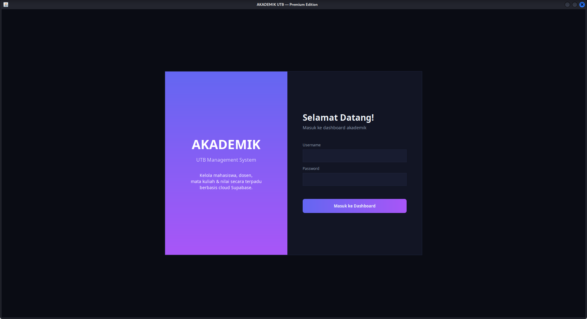 | 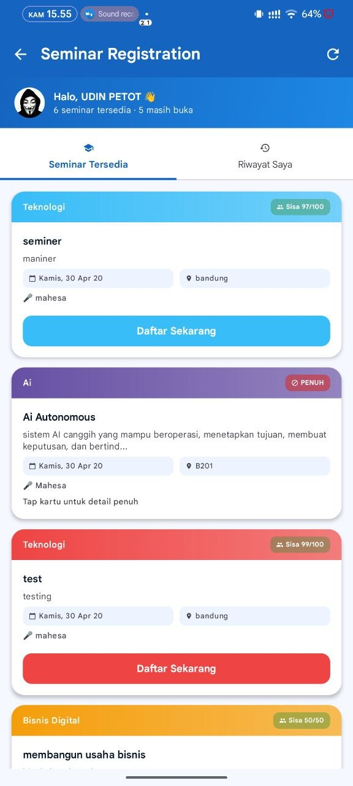 | 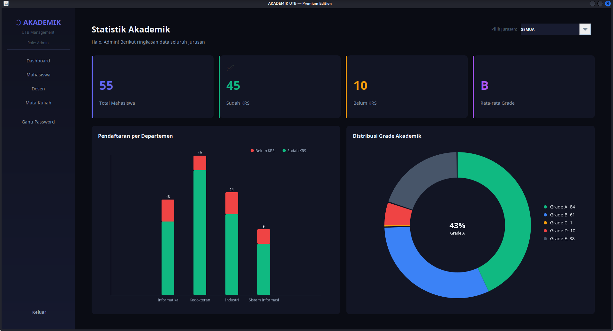 |
---

## 🛠 Teknologi yang Digunakan

- **Frontend:** Kotlin, Jetpack Compose (Material 3), Compose Navigation, Coil (Image Loading).
- **Backend:** Supabase (Auth, Postgres Database, Real-time).
- **Networking:** Ktor Client, Kotlinx Serialization.
- **Arsitektur:** MVVM (Model-View-ViewModel), Repository Pattern.

---

## 📦 Unduh Rilis

Aplikasi siap pakai (APK) telah dikompilasi dan dapat diunduh pada halaman **Releases** repositori ini.

👉 **[Download Kelasin APK Latest Release](https://github.com/looplipop/kelasin/releases)**

---

Dibuat dengan ❤️ untuk kemudahan pendidikan digital.

